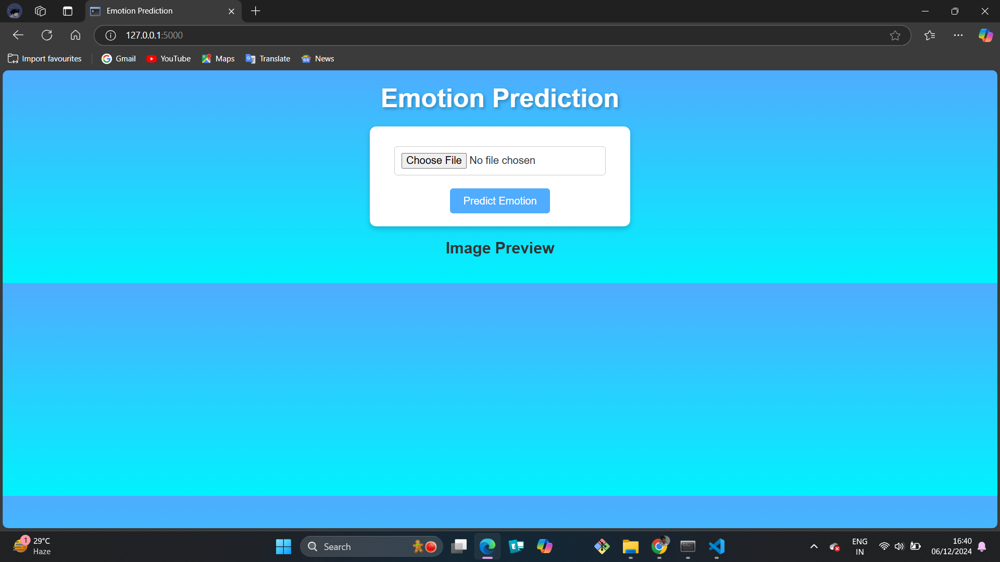
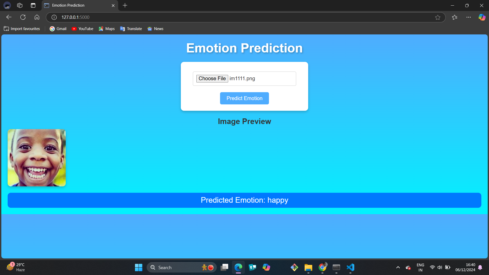

# Emotion-Detection-App
## Emotion-Detection
Project Developed using modules like Tensor-flow,keras,PIL,cv2,matplotlib,cnn,flask 


----

# Emotion Prediction Web Application

A Flask-based web app that predicts human emotions from facial images using a deep learning model.

---

## Features

- Predicts emotions: *Happy, Sad, Angry, Surprised, Neutral, Fearful, Disgusted*.
- Simple web interface for uploading images.
- REST API for emotion prediction.

---

## Quick Start

1. **Clone the repository**:
   ```bash
   git clone https://github.com/rishi146196/Emotion-Detection.git
   cd emotion-prediction-app
   ```

2. **Install dependencies**:
   ```bash
   pip install -r requirements.txt
   ```

3. **Add the model**: Place `emtions.h5` in the project directory.

4. **Run the app**:
   ```bash
   python app.py
   ```

5. **Access**: Open `http://127.0.0.1:5000/` in your browser.

---

## API Endpoint

- **URL**: `/predict`  
- **Method**: POST  
- **Payload**: An image file (`file` key).  
- **Response**: Predicted emotion in JSON format:
  ```json
  {"emotion": "happy"}
  ```

---

## File Structure

- `app.py`: Main application file.  
- `emtions.h5`: Pre-trained emotion classification model.  
- `templates/index.html`: Frontend for uploading images.  

- `static/css`:enhance gui look 

---

## Future Plans

- Deploy to a live server.
- Enhance UI/UX.
- Add features like liveness detection.

## Interface


## Prediction 
- `model acheive 90% accuracy so model can able to predict emotions correctly 90/100`

